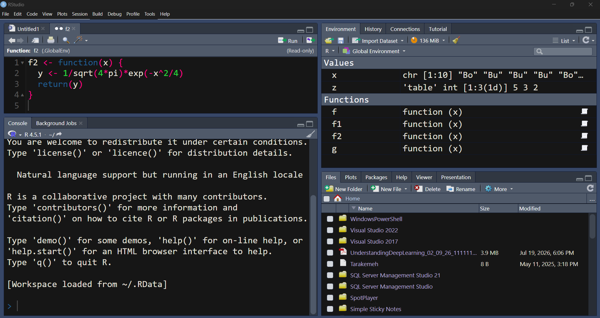

# جلسه اول
## بخش ۱: آشنایی با محیط R و RStudio 🔬

در این بخش، پژوهشگر با محیط کاری R و RStudio آشنا می‌شود و می‌آموزد چگونه اولین دستورات تحلیلی را در R اجرا کند. تمرکز این بخش بر درک نقش R در تحلیل داده‌های پژوهشی علوم شیلات، آبزیان و میگو، شناخت اجزای محیط RStudio، ایجاد فایل Script، تعریف متغیرها و تشخیص انواع داده‌های پایه در R است.

---
## ۱. معرفی R و RStudio و کاربرد آن در پژوهش‌های علمی 🧪

### زبان R چیست؟

برنامه R یک زبان برنامه‌نویسی و محیط محاسبات آماری است که به‌طور گسترده برای تحلیل داده، مدل‌سازی آماری، ترسیم نمودار، شبیه‌سازی، یادگیری ماشین و گزارش‌نویسی علمی استفاده می‌شود.

در پژوهش‌های علوم شیلات، آبزیان و میگو، R می‌تواند برای تحلیل داده‌هایی مانند موارد زیر به کار رود:

- رشد ماهی یا میگو در تیمارهای مختلف غذایی
- مقایسه نرخ بقا در سیستم‌های پرورشی مختلف
- بررسی اثر شوری، دما، pH و اکسیژن محلول بر شاخص‌های زیستی
- تحلیل داده‌های صید و تلاش صیادی
- مدل‌سازی رابطه وزن و طول ماهی
- تحلیل داده‌های آزمایش‌های تغذیه‌ای
- بررسی تنوع زیستی آبزیان
- تحلیل داده‌های مزرعه‌های پرورش میگو
- آماده‌سازی نمودارهای علمی برای مقاله و گزارش پژوهشی

برای مثال، در یک پژوهش تغذیه‌ای میگو ممکن است داده‌هایی شامل وزن اولیه، وزن نهایی، ضریب تبدیل غذایی، نرخ رشد ویژه و درصد بقا ثبت شود. R این امکان را فراهم می‌کند که این داده‌ها به‌صورت دقیق، قابل تکرار و مستند تحلیل شوند.

---

### برنامه RStudio چیست؟

برنامه RStudio یک محیط توسعه یکپارچه یا IDE برای کار با R است. خود R موتور محاسباتی است، اما RStudio محیطی کاربرپسند برای نوشتن، اجرای کد، مدیریت فایل‌ها، مشاهده نمودارها، نصب بسته‌ها و مستندسازی تحلیل‌ها فراهم می‌کند.

به بیان ساده:

| ابزار | نقش |
|---|---|
| R | زبان و موتور آماری |
| RStudio | محیط کار حرفه‌ای برای استفاده آسان‌تر از R |

بنابراین برای کار پژوهشی، معمولاً ابتدا R نصب می‌شود و سپس RStudio برای مدیریت بهتر تحلیل‌ها مورد استفاده قرار می‌گیرد.


---

##  مزایای R نسبت به Excel و SPSS 📊

برنامه‌های Excel و SPSS ابزارهای مفیدی هستند، اما در پژوهش‌های پیشرفته، R مزایای مهمی دارد.

### مزایای R نسبت به Excel

| ویژگی                | Excel        | R             |
| -------------------- | ------------ | ------------- |
| مناسب برای ورود داده | بله          | بله           |
| تحلیل آماری پیشرفته  | محدود        | بسیار گسترده  |
| تکرارپذیری تحلیل     | ضعیف         | بسیار قوی     |
| مستندسازی کد         | محدود        | کامل          |
| تحلیل داده‌های بزرگ  | محدود        | قوی‌تر        |
| نمودارهای علمی       | نسبتاً محدود | بسیار حرفه‌ای |
| کنترل خطا            | دشوار        | دقیق‌تر       |
| مناسب مقاله‌نویسی    | متوسط        | بسیار مناسب   |

در Excel بسیاری از عملیات با کلیک انجام می‌شوند. این موضوع در ظاهر ساده است، اما در پژوهش علمی یک مشکل جدی ایجاد می‌کند: تکرارپذیری پایین.

اگر چند ماه بعد بخواهید دقیقاً همان تحلیل را برای داده‌های جدید انجام دهید، ممکن است فراموش کنید چه فیلترها، فرمول‌ها یا تنظیماتی اعمال کرده‌اید. اما در R تمام مراحل تحلیل در قالب کد ذخیره می‌شود.

---

### مزایای R نسبت به SPSS

| ویژگی | SPSS | R |
|---|---|---|
| رابط گرافیکی ساده | بله | کمتر |
| نیاز به برنامه‌نویسی | کم | بیشتر |
| انعطاف‌پذیری | متوسط | بسیار بالا |
| بسته‌های تخصصی جدید | محدودتر | بسیار گسترده |
| رایگان بودن | خیر | بله |
| توسعه‌پذیری | محدود | بسیار زیاد |
| مناسب تحلیل‌های نوین | متوسط | بسیار قوی |

برنامه‌ SPSS برای تحلیل‌های کلاسیک مانند t-test، ANOVA و رگرسیون خطی مناسب است، اما در تحلیل‌های پیشرفته‌تر مانند مدل‌های آمیخته، مدل‌های بیزی، یادگیری ماشین، تحلیل سری زمانی، تحلیل مکانی، مدل‌سازی غیرخطی رشد، یا نمودارهای سفارشی علمی، R انعطاف بسیار بالاتری دارد.

---

## آشنایی با محیط RStudio 🖥️

پس از باز کردن RStudio، معمولاً با چهار ناحیه اصلی روبه‌رو می‌شوید. چینش دقیق ممکن است بسته به تنظیمات نرم‌افزار کمی متفاوت باشد.




---
## پنل Console

پنل Console محل اجرای مستقیم دستورات R است. زمانی که یک دستور را در Console می‌نویسید و Enter می‌زنید، R همان لحظه آن را اجرا می‌کند.

مثال:

```r
2 + 3
```

خروجی:

```r
[1] 5
```

علامت `[1]` به این معناست که خروجی از عنصر اول شروع شده است. این علامت بخشی از نمایش خروجی R است و معمولاً در تحلیل‌ها مشکل‌ساز نیست.

مثال دیگر:

```r
sqrt(64)
```

خروجی:

```r
[1] 8
```

پنل Console برای آزمون سریع دستورات مناسب است، اما برای تحلیل‌های پژوهشی کامل بهتر است از Script استفاده شود.

---

## پنل Script

پنل Script فایلی است که کدهای R در آن نوشته و ذخیره می‌شوند. استفاده از Script برای پژوهش علمی ضروری است، زیرا تحلیل شما را قابل ذخیره، اصلاح، بازبینی و تکرار می‌کند.

برای ایجاد Script جدید:

```text
File > New File > R Script
```

یا با کلید میانبر:

```text
Ctrl + Shift + N
```

در فایل Script می‌توانید چندین خط کد بنویسید و هر خط یا بخش را اجرا کنید.

برای اجرای یک خط کد در Script:

```text
Ctrl + Enter
```

نمونه کد در Script:

```r
initial_weight <- 2.5
final_weight <- 14.8
weight_gain <- final_weight - initial_weight
weight_gain
```

خروجی:

```r
[1] 12.3
```

---

## پنل Environment

پنجره Environment اشیایی را نشان می‌دهد که در حافظه R ساخته شده‌اند؛ مانند متغیرها، داده‌ها، جدول‌ها، مدل‌ها و خروجی‌های تحلیلی.

برای مثال اگر کد زیر را اجرا کنید:

```r
salinity <- 25
temperature <- 29
survival <- 87.5
```

در Environment سه متغیر مشاهده می‌شود:

```r
salinity
temperature
survival
```

این بخش برای کنترل وضعیت تحلیل بسیار مفید است. پژوهشگر می‌تواند ببیند چه داده‌هایی در محیط کاری فعال هستند.

---

## پنل Files

پنجره Files امکان مشاهده فایل‌ها و پوشه‌های مسیر کاری را فراهم می‌کند. در پژوهش‌های واقعی، بهتر است برای هر پروژه یک پوشه مشخص داشته باشید.

برای مثال:

```text
shrimp_growth_project
```

داخل این پوشه می‌توان فایل‌های زیر را نگهداری کرد:

```text
data
scripts
outputs
figures
reports
```

ساختار پیشنهادی برای پروژه‌های پژوهشی:

```text
project_name/
  data/
  scripts/
  outputs/
  figures/
  reports/
```

این ساختار باعث می‌شود تحلیل شما منظم و قابل پیگیری باشد.

---

## پنل Plots

پنجره Plots نمودارهای تولیدشده در R را نمایش می‌دهد.

---

## پنل Packages

پنل Packages یا بسته‌ها مجموعه‌ای از توابع، داده‌ها و ابزارهای آماده هستند که قابلیت‌های R را گسترش می‌دهند.

برای نصب یک بسته:

```r
install.packages("ggplot2")
```

برای فعال‌سازی بسته:

```r
library(ggplot2)
```

نکته مهم این است که نصب بسته فقط یک‌بار انجام می‌شود، اما در هر جلسه کاری که بخواهید از آن بسته استفاده کنید باید آن را با `()library` فعال کنید.

برخی بسته‌های پرکاربرد برای تحلیل داده‌های پژوهشی:

| بسته | کاربرد |
|---|---|
| `ggplot2` | ترسیم نمودارهای علمی |
| `dplyr` | مدیریت و خلاصه‌سازی داده |
| `readr` | ورود داده‌های متنی و CSV |
| `tidyr` | مرتب‌سازی ساختار داده |
| `car` | آزمون‌های آماری تکمیلی |
| `lme4` | مدل‌های آمیخته |
| `nlme` | مدل‌های آمیخته و غیرخطی |
| `vegan` | تحلیل‌های بوم‌شناسی و تنوع زیستی |
| `FSA` | تحلیل‌های شیلاتی |
| `agricolae` | آزمون‌های مقایسه میانگین |

---

## پنل Help

بخش Help برای مشاهده راهنمای توابع R استفاده می‌شود.

برای مشاهده راهنمای یک تابع:

```r
?mean
```

یا:

```r
help(mean)
```

برای جست‌وجوی یک عبارت:

```r
??anova
```

در پژوهش‌های علمی، استفاده از Help اهمیت زیادی دارد؛ زیرا هر تابع ممکن است آرگومان‌ها، پیش‌فرض‌ها و محدودیت‌های خاص خود را داشته باشد.

مثلاً برای تابع `mean()` می‌توان بررسی کرد که چگونه مقادیر گمشده مدیریت می‌شوند.

```r
values <- c(12.5, 13.2, NA, 14.1)
mean(values)
mean(values, na.rm = TRUE)
```

خروجی اول به دلیل وجود مقدار گمشده `NA` قابل محاسبه نیست، اما خروجی دوم میانگین را با حذف مقدار گمشده محاسبه می‌کند.

---

##  ایجاد اولین فایل Script 📝

برای ایجاد اولین فایل Script مراحل زیر را انجام دهید:

1. از منوی بالا گزینه زیر را انتخاب کنید:

```text
File > New File > R Script
```

2. چند دستور ساده بنویسید:

```r
species <- "Litopenaeus vannamei"
initial_weight <- 1.8
final_weight <- 16.4
culture_days <- 60

weight_gain <- final_weight - initial_weight
sgr <- (log(final_weight) - log(initial_weight)) / culture_days * 100

species
weight_gain
sgr
```

3. فایل را ذخیره کنید:

```text
File > Save
```

4. نام پیشنهادی برای فایل:

```text
session01_part01_intro.R
```

در پژوهش‌های واقعی بهتر است نام فایل‌ها کوتاه، انگلیسی، معنادار و بدون فاصله باشند.

نمونه‌های مناسب:

```text
growth_analysis.R
water_quality_summary.R
shrimp_survival.R
length_weight_model.R
```

نمونه‌های نامناسب:

```text
my file.R
analysis final final.R
new data test.R
```

---

##  اجرای دستورات ساده در R

برنامه R می‌تواند مانند یک ماشین‌حساب علمی عمل کند.

### عملیات ریاضی پایه

```r
10 + 5
10 - 5
10 * 5
10 / 5
10^2
```

## جدول توابع متداول برای محاسبات و بررسی داده‌های اولیه

| تابع             | کاربرد                              | نمونه                      |
| ---------------- | ----------------------------------- | -------------------------- |
| `sqrt()`         | محاسبه ریشه دوم                     | `sqrt(25)`                 |
| `log()`          | محاسبه لگاریتم طبیعی                | `log(10)`                  |
| `log10()`        | محاسبه لگاریتم مبنای ۱۰             | `log10(100)`               |
| `exp()`          | محاسبه تابع نمایی                   | `exp(2)`                   |
| `abs()`          | محاسبه قدر مطلق                     | `abs(-4.5)`                |
| `round()`        | گرد کردن مقدار عددی                 | `round(12.567, 2)`         |
| `floor()`        | گرد کردن به عدد صحیح کوچک‌تر        | `floor(12.8)`              |
| `ceiling()`      | گرد کردن به عدد صحیح بزرگ‌تر        | `ceiling(12.2)`            |
| `class()`        | تشخیص نوع داده یا کلاس متغیر        | `class(final_weight)`      |
| `typeof()`       | بررسی نوع داخلی داده                | `typeof(final_weight)`     |
| `is.numeric()`   | بررسی عددی بودن متغیر               | `is.numeric(final_weight)` |
| `is.character()` | بررسی متنی بودن متغیر               | `is.character(species)`    |
| `is.factor()`    | بررسی طبقه‌ای بودن متغیر            | `is.factor(treatment)`     |
| `is.logical()`   | بررسی منطقی بودن متغیر              | `is.logical(oxygen_ok)`    |
| `as.numeric()`   | تبدیل مقدار قابل تبدیل به داده عددی | `as.numeric("12.5")`       |
| `as.character()` | تبدیل مقدار به داده متنی            | `as.character(12.5)`       |
| `as.logical()`   | تبدیل مقدار به داده منطقی           | `as.logical(1)`            |
| `factor()`       | تعریف یک متغیر طبقه‌ای              | `factor("Control")`        |
| `levels()`       | نمایش سطوح متغیر طبقه‌ای            | `levels(treatment)`        |
| `print()`        | نمایش مقدار یا نتیجه محاسبه         | `print(weight_gain)`       |
| `str()`          | نمایش فشرده ساختار و نوع متغیر      | `str(final_weight)`        |
| `ls()`           | نمایش اشیای موجود در محیط کاری      | `ls()`                     |
| `rm()`           | حذف یک متغیر از محیط کاری           | `rm(final_weight)`         |
| `help()`         | مشاهده راهنمای یک تابع              | `help(log)`                |

---

##  تعریف متغیرها در R

متغیر نامی است که به یک مقدار اختصاص داده می‌شود. در R معمولاً برای مقداردهی از عملگر `<-` استفاده می‌شود.

```r
temperature <- 28.5
salinity <- 22
ph <- 7.8
dissolved_oxygen <- 5.6
```

اکنون می‌توان از این متغیرها در محاسبات استفاده کرد.

```r
temperature + 2
salinity * 1.1
```

مثال پژوهشی:

```r
initial_weight <- 2.4
final_weight <- 15.9
weight_gain <- final_weight - initial_weight
weight_gain
```

خروجی:

```r
[1] 13.5
```

---

## قواعد نام‌گذاری متغیرها در R

در R نام متغیر باید خوانا، معنادار و سازگار با قواعد زبان باشد.

### نام‌های مناسب

```r
final_weight
initial_weight
survival_rate
water_temperature
feed_conversion_ratio
```

### نام‌های نامناسب

```r
final weight <- 15.2
1weight <- 15.2
survival-rate <- 85
```

نام متغیر نباید با عدد شروع شود و نباید شامل فاصله باشد. بهتر است برای جداسازی کلمات از `_` استفاده شود.

---

##  انواع داده در R

در R هر مقدار دارای یک نوع داده است. شناخت نوع داده برای تحلیل آماری ضروری است؛ زیرا بسیاری از خطاهای تحلیلی به دلیل تعریف نادرست نوع متغیر رخ می‌دهند.

چهار نوع داده پایه که در این بخش بررسی می‌شوند:

- عددی: `numeric`
- متنی: `character`
- طبقه‌ای: `factor`
- منطقی: `logical`

---

##  داده عددی numeric

داده عددی شامل اعداد صحیح یا اعشاری است. بیشتر متغیرهای کمی پژوهش‌های شیلاتی از نوع عددی هستند.

نمونه‌ها:

- وزن میگو
- طول ماهی
- دمای آب
- شوری
- اکسیژن محلول
- نرخ رشد
- ضریب تبدیل غذایی

مثال:

```r
fish_length <- 18.6
fish_weight <- 95.4
water_temperature <- 27.8
salinity <- 18.5
```

بررسی نوع داده:

```r
class(fish_length)
```

خروجی:

```r
[1] "numeric"
```

محاسبه با داده‌های عددی:

```r
initial_weight <- 3.2
final_weight <- 19.7
weight_gain <- final_weight - initial_weight
weight_gain
```

---

## داده متنی character

داده متنی برای ذخیره کلمات، نام‌ها، کدها و شناسه‌ها استفاده می‌شود. مقدار متنی باید داخل علامت نقل‌قول قرار گیرد.

مثال:

```r
species <- "Cyprinus carpio"
pond_id <- "Pond_A"
sampling_site <- "Station_1"
```

بررسی نوع داده:

```r
class(species)
```

خروجی:

```r
[1] "character"
```

نکته مهم: حتی اگر یک عدد داخل علامت نقل‌قول قرار گیرد، از دید R متنی محسوب می‌شود.

```r
sample_code <- "101"
class(sample_code)
```

خروجی:

```r
[1] "character"
```

در پژوهش‌ها، کد نمونه، شماره استخر، نام ایستگاه و نام گونه معمولاً به‌صورت `character` ذخیره می‌شوند؛ مگر اینکه نیاز به تحلیل طبقه‌ای داشته باشند.

---

## داده طبقه‌ای factor

داده طبقه‌ای برای متغیرهایی استفاده می‌شود که دارای گروه‌ها یا سطوح مشخص هستند.

نمونه‌ها در پژوهش‌های شیلات و میگو:

- نوع تیمار غذایی
- سطح پروتئین جیره
- سیستم پرورش
- جنسیت ماهی
- فصل نمونه‌برداری
- گروه شوری
- نوع مکمل غذایی

مثال:

```r
diet <- factor("Diet_A")
culture_system <- factor("Biofloc")
```

بررسی نوع داده:

```r
class(diet)
```

خروجی:

```r
[1] "factor"
```

برای تعریف چند سطح:

```r
treatment <- factor(c("Control", "Probiotic", "Prebiotic", "Synbiotic"))
treatment
```

مشاهده سطوح:

```r
levels(treatment)
```

خروجی:

```r
[1] "Control"   "Prebiotic" "Probiotic" "Synbiotic"
```

توجه کنید که R معمولاً سطوح factor را به‌ترتیب الفبایی مرتب می‌کند. اگر ترتیب خاصی مدنظر باشد، باید آن را صریحاً مشخص کرد.

```r
protein_level <- factor(c("Low", "Medium", "High"),
                        levels = c("Low", "Medium", "High"))
protein_level
```

این موضوع در تحلیل‌هایی مانند ANOVA و ترسیم نمودار اهمیت دارد.

---

##  داده منطقی logical

داده منطقی فقط دو مقدار دارد:

```r
TRUE
FALSE
```

این نوع داده برای بیان وضعیت‌های درست/نادرست یا بله/خیر استفاده می‌شود.

مثال‌های پژوهشی:

- آیا ماهی زنده مانده است؟
- آیا مقدار اکسیژن در محدوده مطلوب است؟
- آیا نمونه آلوده است؟
- آیا وزن نهایی از وزن اولیه بیشتر است؟

مثال:

```r
survived <- TRUE
disease_detected <- FALSE
```

بررسی نوع داده:

```r
class(survived)
```

خروجی:

```r
[1] "logical"
```

مثال با شرط:

```r
dissolved_oxygen <- 5.8
oxygen_ok <- dissolved_oxygen >= 5
oxygen_ok
```

خروجی:

```r
[1] TRUE
```

مثال دیگر:

```r
initial_weight <- 4.1
final_weight <- 3.8
growth_positive <- final_weight > initial_weight
growth_positive
```

خروجی:

```r
[1] FALSE
```

---

##  بررسی نوع داده‌ها

برای بررسی نوع داده‌ها می‌توان از تابع `class()` استفاده کرد.

```r
weight <- 12.6
species <- "Oreochromis niloticus"
treatment <- factor("Control")
survived <- TRUE

class(weight)
class(species)
class(treatment)
class(survived)
```

خروجی مورد انتظار:

```r
[1] "numeric"
[1] "character"
[1] "factor"
[1] "logical"
```

تابع دیگر برای بررسی ساختار اشیا:

```r
str(weight)
str(species)
str(treatment)
str(survived)
```

---

##  مثال‌های کوتاه 

### مثال ۱: محاسبه افزایش وزن میگو

```r
initial_weight <- 2.2
final_weight <- 18.9
weight_gain <- final_weight - initial_weight
weight_gain
```

---

### مثال ۲: محاسبه نرخ رشد ویژه

```r
initial_weight <- 2.2
final_weight <- 18.9
days <- 60

sgr <- (log(final_weight) - log(initial_weight)) / days * 100
sgr
```

---

### مثال ۳: محاسبه درصد بقا

```r
initial_number <- 500
final_number <- 438

survival_rate <- final_number / initial_number * 100
survival_rate
```

---

### مثال ۴: بررسی مناسب بودن اکسیژن محلول

```r
dissolved_oxygen <- 4.7
oxygen_status <- dissolved_oxygen >= 5
oxygen_status
```

---

### مثال ۵: تعریف تیمار غذایی به‌عنوان factor

```r
diet_treatment <- factor("Probiotic")
class(diet_treatment)
```

---

## خطاهای رایج در شروع کار با R ⚠️

### خطای ۱: فراموش کردن علامت نقل‌قول برای متن

کد نادرست:

```r
species <- Litopenaeus vannamei
```

کد درست:

```r
species <- "Litopenaeus vannamei"
```

---

### خطای ۲: استفاده از فاصله در نام متغیر

کد نادرست:

```r
final weight <- 15.8
```

کد درست:

```r
final_weight <- 15.8
```

---

### خطای ۳: تفاوت حروف بزرگ و کوچک

برنامه R به حروف بزرگ و کوچک حساس است.

```r
Weight <- 12
weight <- 15

Weight
weight
```

در اینجا `Weight` و `weight` دو متغیر متفاوت هستند.

---

### خطای ۴: استفاده از ویرگول به‌جای نقطه در عدد اعشاری

کد نادرست:

```r
temperature <- 28,5
```

کد درست:

```r
temperature <- 28.5
```

در R برای عدد اعشاری باید از نقطه استفاده شود.

---

##  تمرین‌های خودآزمایی ✍️

### تمرین ۱

برای یک آزمایش پرورش میگو، متغیرهای زیر را در R تعریف کنید:

| متغیر | مقدار |
|---|---|
| گونه | `Litopenaeus vannamei` |
| وزن اولیه | `1.5` گرم |
| وزن نهایی | `14.2` گرم |
| مدت پرورش | `56` روز |
| تعداد اولیه | `1000` |
| تعداد نهایی | `923` |
| تیمار | `Probiotic` |

سپس نوع هر متغیر را با `class()` بررسی کنید.

---

### تمرین ۲

برای داده‌های تمرین قبل، شاخص‌های زیر را محاسبه کنید:

$$
WG = W_f - W_i
$$

$$
SGR(\%) = \frac{\ln(W_f) - \ln(W_i)}{t} \times 100
$$

$$
Survival(\%) = \frac{N_f}{N_i} \times 100
$$

---

### تمرین ۳

متغیری به نام `dissolved_oxygen` با مقدار `4.9` تعریف کنید. سپس بررسی کنید آیا اکسیژن محلول حداقل `5` میلی‌گرم در لیتر است یا خیر.

---

### تمرین ۴

یک متغیر طبقه‌ای برای سطح پروتئین جیره با سه سطح زیر تعریف کنید:

```r
Low
Medium
High
```

ترتیب سطوح را به همین شکل مشخص کنید.

---

## مثال: داده مقدماتی از آزمایش رشد میگوی وانامی 🦐📌

در یک آزمایش مقدماتی، پژوهشگری اثر یک جیره حاوی مکمل پروبیوتیک را بر رشد میگوی وانامی بررسی کرده است. در ابتدای دوره، میانگین وزن میگوها `2.3` گرم بوده و پس از `60` روز به `17.6` گرم رسیده است. تعداد میگوها در ابتدای آزمایش `800` قطعه و در پایان `752` قطعه بوده است. میانگین اکسیژن محلول نیز `5.4` میلی‌گرم در لیتر گزارش شده است.

کد زیر متغیرهای اصلی را تعریف کرده و چند شاخص اولیه را محاسبه می‌کند:

```r
species <- "Litopenaeus vannamei"
treatment <- factor("Probiotic")
initial_weight <- 2.3
final_weight <- 17.6
culture_days <- 60
initial_number <- 800
final_number <- 752
dissolved_oxygen <- 5.4

weight_gain <- final_weight - initial_weight
sgr <- (log(final_weight) - log(initial_weight)) / culture_days * 100
survival_rate <- final_number / initial_number * 100
oxygen_ok <- dissolved_oxygen >= 5
```
نتیجه اجرا در کنسول 
```r
> class(species)
[1] "character"
> class(treatment)
[1] "factor"
> class(initial_weight)
[1] "numeric"
> class(oxygen_ok)
[1] "logical"
> > weight_gain
[1] 15.3
> sgr
[1] 3.39165
> survival_rate
[1] 94
> oxygen_ok
[1] TRUE
```

