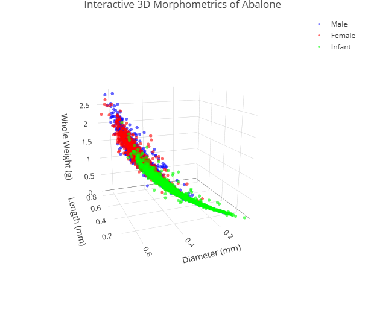

# جلسه دوم — بخش دوم: 
## رسم نمودارهای علمی 

در این بخش، یاد می‌گیریم که چگونه با استفاده از توابع پیش‌فرض R و کتابخانه‌های تخصصی مانند `ggplot2`، `corrplot` و `plotly` نمودارهای علمی، استاندارد و با کیفیت بالا برای ارائه‌های پژوهشی و مقالات شیلاتی رسم کنیم. برای این منظور از داده‌های واقعی زیست‌سنجی آبالون (UCI Abalone Dataset) استفاده خواهیم کرد.

---

## ۱. آماده‌سازی داده‌ها و فراخوانی کتابخانه‌ها

ابتدا داده‌ها را وارد محیط R کرده و کتابخانه‌های مورد نیاز را نصب و فراخوانی می‌کنیم.

```r
# url <- "https://archive.ics.uci.edu/ml/machine-learning-databases/abalone/abalone.data"
url <- "dataset/abalone.data"
abalone <- read.csv(
  url,
  header = FALSE,
  col.names = c(
    "Sex",
    "Length",
    "Diameter",
    "Height",
    "Whole_weight",
    "Shucked_weight",
    "Viscera_weight",
    "Shell_weight",
    "Rings"
  )
)

abalone$Sex <- factor(abalone$Sex, levels = c("M", "F", "I"), labels = c("Male", "Female", "Infant"))
abalone$Age <- abalone$Rings + 1.5

# install.packages("corrplot","ggplot2","plotly")
library(corrplot)
library(ggplot2)
library(plotly)
```

---

## ۲. نمودار ستونی (Barplot)

نمودار ستونی برای نمایش فراوانی متغیرهای کیفی مانند جنسیت آبالون‌ها استفاده می‌شود.

```r
sex_table <- table(abalone$Sex)

barplot(
  sex_table,
  main = "Frequency of Abalone by Sex",
  xlab = "Sex Group",
  ylab = "Count",
  col = c("royalblue", "hotpink", "chartreuse4"),
  border = "black",
  ylim = c(0, 1800)
)
```

<center></center>

---

## ۳. نمودار جعبه‌ای (Boxplot)

نمودار جعبه‌ای ابزاری کلیدی برای مقایسه توزیع، میانه و مقادیر پرت یک متغیر کمی در گروه‌های مختلف کیفی است. در اینجا وزن کل را در بین سه گروه جنسی مقایسه می‌کنیم.

```r
boxplot(
  Whole_weight ~ Sex,
  data = abalone,
  main = "Abalone Whole Weight by Sex",
  xlab = "Sex Category",
  ylab = "Whole Weight (g)",
  col = c("skyblue", "pink", "lightgreen"),
  border = "darkgray",
  notch = TRUE
)
```


<center></center>
---

## ۴. نمودار پراکنش (Scatter plot)

از نمودار پراکنش برای بررسی رابطه دو متغیر کمی استفاده می‌شود. در این بخش، رابطه بین طول صدف و وزن کل را رسم می‌کنیم.

```r
plot(
  x = abalone$Length,
  y = abalone$Whole_weight,
  main = "Shell Length vs. Whole Weight in Abalone",
  xlab = "Length (mm)",
  ylab = "Whole Weight (g)",
  col = adjustcolor("darkblue", alpha.f = 0.3),
  pch = 19,
  cex = 0.8
)

abline(
  lm(Whole_weight ~ Length, data = abalone),
  col = "red",
  lwd = 2
)
```


<center></center>
---

## ۵. نمودار دایره‌ای (Pie Chart)

نمودار دایره‌ای برای نشان دادن سهم نسبی هر گروه از کل نمونه‌ها کاربرد دارد.

```r
sex_percent <- round(100 * prop.table(sex_table), 1)
labels_pie <- paste(names(sex_table), "-", sex_percent, "%", sep = "")

pie(
  sex_table,
  labels = labels_pie,
  col = c("deepskyblue", "magenta", "orange"),
  main = "Proportion of Sex Groups in Abalone Dataset"
)
```


<center></center>
---

## ۶. هیستوگرام و نمودار توزیع نرمال

برای بررسی فرضیه نرمال بودن داده‌های سن (یا تعداد حلقه‌ها)، هیستوگرام داده‌ها را همراه با منحنی توزیع نرمال برازش‌شده رسم می‌کنیم.

```r
hist(
  abalone$Rings,
  prob = TRUE,
  breaks = 20,
  main = "Distribution of Abalone Rings with Normal Curve",
  xlab = "Number of Rings",
  col = "lightgray",
  border = "white",
  xlim = c(0, 30)
)

x_seq <- seq(min(abalone$Rings), max(abalone$Rings), length = 100)
y_normal <- dnorm(x_seq, mean = mean(abalone$Rings), sd = sd(abalone$Rings))

lines(x_seq, y_normal, col = "red", lwd = 2.5)
```


<center></center>


---

## ۷. تحلیل همبستگی چندگانه و هیت‌مپ همبستگی

با استفاده از تابع `pairs()`، نمودار ماتریس پراکنش متغیرهای کمی را رسم کرده و سپس با پکیج `corrplot` هیت‌مپ گرافیکی ضرایب همبستگی را ترسیم می‌کنیم.

```r
biometric_data <- abalone[, c("Length", "Diameter", "Height", "Whole_weight", "Rings")]

pairs(
  biometric_data,
  col = adjustcolor("darkcyan", alpha.f = 0.2),
  pch = 19,
  main = "Scatter Plot Matrix of Biometric Variables"
)

cor_matrix <- cor(biometric_data)

corrplot(
  cor_matrix,
  method = "ellipse",
  type = "upper",
  order = "hclust",
  tl.col = "black",
  tl.srt = 45,
  addCoef.col = "black"
)
```


<center></center>

---

## ۸. نمودار خطی برای داده‌های روند (داده‌های شبیه‌سازی‌شده زمانی)

از آنجا که دیتاست آبالون فاقد متغیر سری زمانی است، روند میانگین وزن کل آبالون‌ها را بر اساس رتبه‌بندی سن صدف (متغیر `Rings`) به عنوان یک روند خطی شبیه‌سازی‌شده رسم می‌کنیم.

```r
age_trend <- aggregate(Whole_weight ~ Rings, data = abalone, mean)

plot(
  age_trend$Rings,
  age_trend$Whole_weight,
  type = "o",
  pch = 16,
  col = "darkred",
  lwd = 2,
  main = "Mean Whole Weight Trend by Abalone Age Group (Rings)",
  xlab = "Rings (Indicator of Age)",
  ylab = "Mean Whole Weight (g)"
)
```


<center></center>


---

## ۹. نمودارهای مناسب تحلیل‌های گروهی

ابتدا با استفاده از تابع `()aggregate` میانگین و انحراف معیار وزن کل را در هر گروه جنسی محاسبه کرده و سپس نمودار ستونی آن را همراه با خطای انحراف معیار رسم می‌کنیم.

```r
agg_data <- aggregate(Whole_weight ~ Sex, data = abalone, function(x) c(mean = mean(x), sd = sd(x)))
agg_df <- data.frame(Sex = agg_data$Sex, Mean = agg_data$Whole_weight[, 1], SD = agg_data$Whole_weight[, 2])

bp <- barplot(
  agg_df$Mean,
  names.arg = agg_df$Sex,
  col = c("lightblue", "lightpink", "lightyellow"),
  ylim = c(0, 1.8),
  main = "Mean Whole Weight (±SD) by Sex",
  xlab = "Sex Group",
  ylab = "Mean Weight (g)"
)

arrows(
  x0 = bp,
  y0 = agg_df$Mean - agg_df$SD,
  x1 = bp,
  y1 = agg_df$Mean + agg_df$SD,
  angle = 90,
  code = 3,
  length = 0.1,
  lwd = 1.5
)
```


<center></center>


---

## ۱۰. نمودارهای پیشرفته با `ggplot2` و `plotly`

کتابخانه‌های مدرن به شما اجازه می‌دهند نمودارهای حرفه‌ای‌تر و تعاملی رسم کنید.

### مثال ggplot2: رسم نمودار چندمتغیره
نمودار پراکنش طول در برابر وزن کل به تفکیک جنسیت و سایز متغیرها:

```r
ggplot(abalone, aes(x = Length, y = Whole_weight, color = Sex)) +
  geom_point(alpha = 0.4) +
  geom_smooth(method = "lm", se = FALSE, lwd = 1.2) +
  theme_classic() +
  labs(
    title = "Abalone Growth: Length vs. Whole Weight",
    x = "Length (mm)",
    y = "Whole Weight (g)"
  )
```


<center></center>

---
### مثال plotly: نمودار سه بعدی تعاملی (Interactive 3D Scatter)
پژوهشگران می‌توانند با حرکت ماوس روی این نمودار، مقادیر متغیرهای طول، قطر و وزن کل را بررسی کنند.

```r
plot_ly(
  data = abalone,
  x = ~Length,
  y = ~Diameter,
  z = ~Whole_weight,
  color = ~Sex,
  colors = c("blue", "red", "green"),
  type = "scatter3d",
  mode = "markers",
  marker = list(size = 3, opacity = 0.6)
) %>%
  layout(
    title = "Interactive 3D Morphometrics of Abalone",
    scene = list(
      xaxis = list(title = "Length (mm)"),
      yaxis = list(title = "Diameter (mm)"),
      zaxis = list(title = "Whole Weight (g)")
    )
  )
```


<center></center>

---

## 🛑 پروژه  

این پروژه برای ارزیابی مهارت‌های آماری و تجسم داده شما طراحی شده است. از نوشتن کدهای موازی یا داده‌های فرضی خودداری کنید.

### صورت پروژه:
یک فایل گزارش تحقیقاتی در قالب یک اسکریپت تمیز R آماده کنید که بر روی متغیرهای زیستی دیتاست **UCI Abalone Dataset** تحلیل‌های زیر را پیاده‌سازی کند:

1. **فراخوانی و فیلتر داده:** داده‌ها را از لینک مرجع لود کنید. زیرمجموعه‌ای شامل فقط نمونه‌های بالغ (حذف نمونه‌های `Infant` از تحلیل) ایجاد کنید.
2. **محاسبه شاخص‌های توصیفی:** میانگین، انحراف معیار، چولگی و ضریب همبستگی بین دو متغیر وزن کل (`Whole_weight`) و وزن گوشت (`Shucked_weight`) را برای نمونه‌های بالغ نر و ماده به تفکیک محاسبه و مقایسه کنید.
3. **رسم نمودارهای پیشرفته:** 
   - یک هیستوگرام با منحنی چگالی توزیع نرمال برای متغیر سن تقریبی (`Age`) کل نمونه‌ها رسم کنید.
   - با استفاده از `ggplot2` یک نمودار Scatter plot بین وزن کل (محور افقی) و وزن گوشت (محور عمودی) رسم کنید، به طوری که نقاط بر اساس متغیر جنسیت رنگ‌آمیزی شده و خط رگرسیون برای هر گروه به تفکیک رسم شود.
   - یک ماتریس همبستگی با استفاده از پکیج `corrplot` برای نمونه‌های بالغ رسم کنید که شامل تمام متغیرهای وزنی صدف، گوشت و احشا باشد.

*راهنمایی:* برای فیلتر کردن نمونه‌های بالغ از دستور `subset(abalone, Sex != "Infant")` استفاده کنید. برای رسم خطوط رگرسیون تفکیکی در ggplot2، متغیر کیفی جنسیت را در بخش `color` در تابع `aes()` نگاشت کنید.