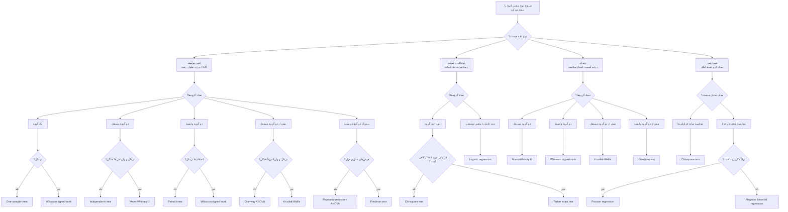

# جلسه سوم — بخش ۱: منطق آزمون‌های آماری در R 🧪

---

**آزمون آماری** یعنی روشی برای تصمیم‌گیری علمی بر اساس داده‌ها؛ تا بفهمیم تفاوت، اثر یا رابطه‌ای که در نتایج می‌بینیم، واقعاً معنادار است یا فقط حاصل تغییرات تصادفی داده‌هاست.

هدف آزمون آماری این است که مشخص کند آیا الگوی مشاهده‌شده در داده‌ها می‌تواند صرفاً ناشی از نوسان تصادفی نمونه‌گیری باشد یا شواهد کافی برای وجود یک تفاوت، رابطه یا اثر واقعی وجود دارد.

---
### 🐟 مثال ۱: آیا نوع خوراک روی رشد ماهی اثر دارد؟

- **مسئله:** مقایسه اثر چند جیره غذایی بر رشد ماهی
- **نمونه‌برداری:** چند مخزن مشابه برای هر جیره غذایی انتخاب می‌شود
- **داده:** وزن اولیه و وزن نهایی ماهی‌ها
- **تحلیل:** بررسی معنادار بودن اختلاف رشد بین جیره‌ها
- **هدف:** تشخیص بهترین جیره از نظر رشد

---

### 🦐 مثال ۲: آیا شوری آب روی بقای میگو اثر دارد؟

- **مسئله:** بررسی اثر سطوح مختلف شوری بر بقای میگو
- **نمونه‌برداری:** میگوها در چند سطح شوری نگهداری می‌شوند
- **داده:** تعداد یا درصد بقای میگوها در پایان آزمایش
- **تحلیل:** مقایسه بقا بین سطوح مختلف شوری
- **هدف:** تعیین محدوده مناسب شوری برای پرورش میگو

---

### 🌾 مثال ۳: آیا نوع کود باعث افزایش عملکرد محصول می‌شود؟

- **مسئله:** مقایسه عملکرد محصول در چند نوع کود
- **نمونه‌برداری:** چند قطعه زمین مشابه با تیمارهای کودی مختلف
- **داده:** مقدار محصول برداشت‌شده از هر قطعه
- **تحلیل:** بررسی معنادار بودن تفاوت عملکرد بین کودها
- **هدف:** انتخاب کود مؤثرتر برای افزایش تولید

---

## مفهوم فرض صفر و فرض مقابل

هر آزمون آماری با دو گزاره علمی شروع می‌شود: فرض صفر و فرض مقابل.

فرض صفر معمولاً بیان می‌کند که «تفاوت، اثر یا رابطه‌ای وجود ندارد». این فرض نقطه شروع تحلیل آماری است و آزمون آماری تلاش می‌کند بررسی کند آیا داده‌ها شواهد کافی علیه آن فراهم می‌کنند یا خیر.

فرض مقابل بیان می‌کند که «تفاوت، اثر یا رابطه‌ای وجود دارد». این همان چیزی است که پژوهشگر معمولاً به دنبال بررسی آن است.

برای نمونه، اگر پژوهشگری بخواهد بررسی کند آیا میانگین وزن میگو در دو جیره غذایی متفاوت است یا خیر، فرض‌ها به صورت مفهومی چنین تعریف می‌شوند:

$$
H_0: \mu_1 = \mu_2
$$

$$
H_1: \mu_1 \neq \mu_2
$$

در اینجا، $\mu_1$ و $\mu_2$ میانگین واقعی وزن میگو در دو گروه جیره غذایی هستند.

اگر هدف بررسی افزایش وزن در یک جیره جدید نسبت به جیره معمولی باشد، فرض مقابل می‌تواند جهت‌دار باشد:

$$
H_0: \mu_{new} \leq \mu_{control}
$$

$$
H_1: \mu_{new} > \mu_{control}
$$

نکته مهم این است که آزمون آماری معمولاً فرض صفر را «اثبات» یا «رد قطعی» نمی‌کند، بلکه بر اساس داده‌های نمونه‌ای تصمیم می‌گیرد آیا شواهد کافی برای رد فرض صفر وجود دارد یا نه.

---
## روش تصمیم‌گیری کلی در آزمون فرض آماری 🧪

### 1. تعریف فرض‌ها

- **فرض صفر:** نبود تفاوت، اثر یا رابطه معنادار
- **فرض مقابل:** وجود تفاوت، اثر یا رابطه معنادار

$$
H_0: \text{No effect}
$$

$$
H_1: \text{Effect exists}
$$

---

### 2. انتخاب سطح معناداری

- سطح معناداری معمولاً برابر با $0.05$ در نظر گرفته می‌شود.
- یعنی پژوهشگر حداکثر **۵ درصد خطای قابل قبول برای رد اشتباه فرض صفر** را می‌پذیرد.
- **مفهوم سطح معناداری:** سطح معناداری یا $\alpha$ آستانه‌ای است که پژوهشگر پیش از انجام آزمون تعیین می‌کند تا مشخص شود چه مقدار شواهد برای رد فرض صفر کافی است.

$$
\alpha = 0.05
$$

---

### 3. اجرای آزمون آماری

- آزمون مناسب بر اساس نوع داده و هدف پژوهش انتخاب می‌شود.
- خروجی مهم آزمون معمولاً مقدار `p-value` است.
- **مفهوم `p-value`:** احتمال مشاهده نتیجه‌ای به اندازه نتیجه فعلی یا شدیدتر از آن، در صورتی که فرض صفر درست باشد.

---

### 4. تصمیم بر اساس `p-value`

- اگر `p-value < 0.05` باشد:
  - فرض صفر رد می‌شود.
  - نتیجه از نظر آماری معنادار است.

- اگر `p-value >= 0.05` باشد:
  - فرض صفر رد نمی‌شود.
  - شواهد کافی برای معنادار بودن نتیجه وجود ندارد.

---

### 5. تفسیر پژوهشی

- تصمیم آماری باید به زبان مسئله پژوهشی بیان شود.
- مثال: نوع خوراک بر رشد ماهی اثر معنادار دارد.
- یا: شواهد کافی برای اثر نوع خوراک بر رشد ماهی مشاهده نشد.

> نکته مهم: آزمون آماری فقط می‌گوید شواهد داده‌ها چقدر قوی است؛ تفسیر نهایی باید با طراحی آزمایش، کیفیت نمونه‌برداری و دانش تخصصی همراه باشد.

---

## تفاوت آزمون پارامتری و ناپارامتری 🧪

- **آزمون‌های پارامتری** بر پایه چند فرض آماری مشخص انجام می‌شوند؛ مهم‌ترین آن‌ها این است که داده‌ها یا خطاهای مدل تقریباً **توزیع نرمال** داشته باشند، واریانس گروه‌ها خیلی متفاوت نباشد، و داده‌ها در مقیاس کمی مناسب اندازه‌گیری شده باشند.

- **آزمون‌های ناپارامتری** به فرض‌های سخت‌گیرانه‌ای مثل نرمال بودن داده‌ها وابستگی کمتری دارند و معمولاً وقتی داده‌ها نرمال نیستند، حجم نمونه کم است، داده‌ها رتبه‌ای هستند، یا مقدارهای پرت وجود دارد استفاده می‌شوند.

> آزمون پارامتری زمانی مناسب‌تر است که فرض‌هایی مثل نرمال بودن و همگنی واریانس‌ها قابل قبول باشند؛ آزمون ناپارامتری زمانی استفاده می‌شود که این فرض‌ها برقرار نباشند یا داده‌ها ماهیت رتبه‌ای و غیرنرمال داشته باشند.

---

## انتخاب آزمون مناسب بر اساس نوع داده و تعداد گروه‌ها

انتخاب آزمون آماری مناسب یکی از مهم‌ترین مهارت‌های پژوهشگر داده‌محور است. پیش از انتخاب آزمون، باید چند پرسش کلیدی پاسخ داده شود:

- متغیر پاسخ کمی است یا کیفی؟
- گروه‌ها مستقل هستند یا وابسته؟
- تعداد گروه‌ها چند تاست؟
- داده‌ها تقریباً نرمال هستند یا خیر؟
- واریانس گروه‌ها قابل مقایسه است یا خیر؟
- هدف تحلیل مقایسه میانگین، بررسی رابطه، پیش‌بینی یا بررسی فراوانی است؟

در یک پژوهش شیلاتی، متغیر پاسخ ممکن است وزن نهایی ماهی، نرخ رشد ویژه، ضریب تبدیل غذایی، درصد بقا، غلظت آمونیاک یا فراوانی بیماری باشد. هرکدام از این متغیرها ساختار آماری متفاوتی دارند و ممکن است آزمون متفاوتی نیاز داشته باشند.

راهنمای مفهومی انتخاب آزمون:

| هدف پژوهش                             | نوع متغیر پاسخ | تعداد گروه‌ها یا متغیرها  | آزمون‌های رایج                       |
| ------------------------------------- | -------------- | ------------------------- | ------------------------------------ |
| مقایسه میانگین یک متغیر با مقدار ثابت | کمی            | یک گروه                   | آزمون t تک‌نمونه‌ای                  |
| مقایسه دو گروه مستقل                  | کمی            | دو گروه مستقل             | آزمون t مستقل یا Mann-Whitney        |
| مقایسه دو اندازه‌گیری وابسته          | کمی            | دو زمان یا دو حالت وابسته | آزمون t زوجی یا Wilcoxon             |
| مقایسه بیش از دو گروه مستقل           | کمی            | سه گروه یا بیشتر          | ANOVA یا Kruskal-Wallis              |
| مقایسه چند تیمار با دو عامل           | کمی            | چند گروه با دو عامل       | ANOVA دوطرفه                         |
| بررسی رابطه دو متغیر کمی              | کمی            | دو متغیر                  | همبستگی Pearson یا Spearman          |
| پیش‌بینی یک متغیر کمی                 | کمی            | یک یا چند پیش‌بین         | رگرسیون خطی                          |
| بررسی ارتباط دو متغیر کیفی            | کیفی           | جدول توافقی               | آزمون کای‌دو یا Fisher               |
| بررسی نسبت یا فراوانی                 | کیفی/شمارشی    | یک یا چند گروه            | آزمون نسبت، کای‌دو یا مدل‌های شمارشی |

